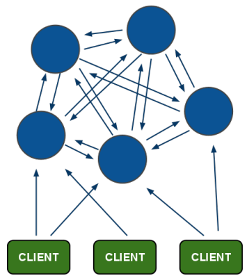
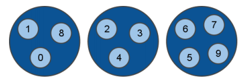
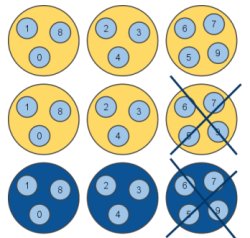
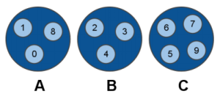
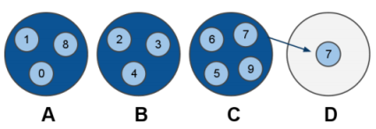
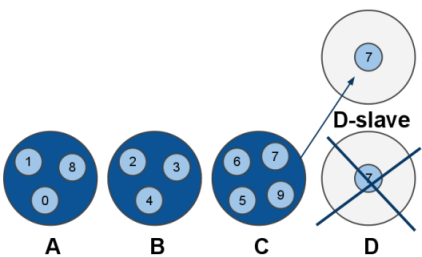
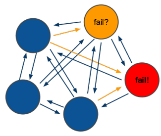

=====================
Redisのクラスタリング
=====================

.. note::

   `Redis Cluster - (a pragmatic approach to distribution) <http://redis.io/presentation/Redis_Cluster.pdf>`_ (分散の実践的アプローチ)の日本語訳です。

.. versionadded:: 2.2

.. * All nodes are directly connected with a service channel.
   * TCP baseport+4000, example 6379 -> 10379.
   * Node to Node protocol is binary, optimized for bandwidth and speed.
   * Clients talk to nodes as usually, using ascii protocol, with minor additions.
   * Nodes don't proxy queries.

Redisでは、実際にクライアントと通信をするポート以外に、サービス用チャンネルを開いてすべてのノードはこのチャンネルを使って直接接続しあいます。TCPのベースのポート+4000番が使われるため、クライアント向けに6379番のポートを使用している場合には、10379番を使用します。ノード間の通信には、バンド幅と速度に最適化されたバイナリプロトコルを使用します。クライアントとの通信では通常はアスキープロトコルを使用しますが、いくつか変更があります。ノード同士は、クエリーをプロキシー(転送)することはありません。

ノード間の通信内容
==================

.. PING: are you ok dude? I'm master for XYZ hash slots. Config is FF89X1JK
.. Gossip: this are info about other nodes I'm in touch with:
.. A replies to my ping, I think its state is OK.
.. B is idle, I guess it's having problems but I need some ACK.

.. PONG: Sure I'm ok dude! I'm master for XYZ hash slots. Config is FF89X1JK
.. Gossip: I want to share with you some info about random nodes:
.. C and D are fine and replied in time.
.. But B is idle for me as well! IMHO it's down!

各ノードは、PING/PONGと同時に、自分が通信した上で判断した周辺ノード情報(Gossip/うわさ話)も一緒に送信します。

PING側
------

* PING: 通信OK? 私は、XYZハッシュスロットのマスターです。設定は ``FF89X1JK`` です。

* Gossip: 私が通信しあっている他のノードの情報はこれです:

   * Aノードは私のpingに対して返事をくれたので、状態はOKだと思います。
   * Bはアイドル中です。おそらく、Bノードでトラブルが発生していていますが、ACK信号を送って欲しいと思います。

PONG側
------

* PONG: 通信OK? 私は、XYZハッシュスロットのマスターです。設定は ``FF89X1JK`` です。

* Gossip: 私はランダムなノードに対しての情報をシェアしたいと考えています:

   * CとDは時間内に返事をくれたので、正しい状態です。
   * Bはアイドル状態です。おそらくダウンしています！

マスター・スレーブと冗長化
==========================

.. Nodes are all connected and functionally equivalent, but actually there are two kind of nodes:
   slave and master nodes:

ノードはすべて接続されていて、すべて同じ機能を持っていますが、マスターノードと、スレーブノードという2種類のノードが存在します。

.. In the example there are two replicas per every master node, so up to two random nodes can go
   down without issues. Working with two nodes down is guaranteed, but in the best case the
   cluster will continue to work as long as there is at least one node for every hash slot.

この図の例では、すべてのマスターノードごとに、2つのレプリカを作っています。この場合、どの2つのノードが落ちてもサービスは維持されます。最良のケースで、すべてのハッシュスロットごとに最低限1つのノードが生き残っていれば、動作は継続されます。

.. What this means so far?

この状態について詳しく説明します。

.. * Every key only exists in a single instance, plus N replicas that
     will never receive writes. So there is no merge, nor application-side
     inconsistency resolution.

* すべてのキーは、1つのインスタンスの中に保持されます。それにプラスして、書き込み命令を受け取らない、N個のレプリカの中にも保持されます。

.. * The price to pay is not resisting to net splits that are bigger
     than replicas-per-hashslot nodes down.

* 訳不明

.. * Master and Slave nodes use the Redis Replication you already know.

* Redisのレプリケーションを使用しているマスターノードとスレーブノードの情報をすでに知っています。

.. * Every physical server will usually hold multiple nodes, both
     slaves and masters, but the redis-trib cluster manager
     program will try to allocate slaves and masters so that the
     replicas are in different physical servers.

* すべての物理サーバは通常、スレーブとマスターを含む複数のノードを保持します。redis-tribクラスタマネージャプログラムは通常、なるべく異なる物理サーバにレプリカが配置されるように、マスターとスレーブを割り当てようとします。

クライアントからのリクエストの処理
==================================

.. Client requests - dummy client

低能なクライアントの場合
------------------------

.. 1. Client => A: GET foo
   2. A => Client: -MOVED 8 192.168.5.21:6391
   3. Client => B: GET foo
   4. B => Client: "bar"

.. list-table::
   :header-rows: 1
   :widths: 3 5 5 10

   - *
     * 送信元
     * 受信先
     * 返信
   - * 1.
     * クライアント
     * Aサーバ
     * :com:`GET` ``foo``
   - * 2.
     * Aサーバ
     * クライアント
     * ``-MOVED 8 192.168.5.21:6391``
   - * 3.
     * クライアント
     * Bサーバ
     * :com:`GET` ``foo``
   - * 2.
     * Bサーバ
     * クライアント
     * ``"bar"``

.. -MOVED 8 ... this error means that hash slot 8 is located at
   the specified IP/port, and the client should reissue the query
   there.

``-MOVED 8...`` というエラーは、ハッシュスロット8は指定されたIP/ポートにあるという情報を返します。クライアントはこの情報を使って再度クエリーを発行する必要があります。

.. Client requests - smart client

賢いクライアントの場合
----------------------

.. 1. Client => A: CLUSTER HINTS
   2. A => Client: ... a map of hash slots -> nodes
   3. Client => B: GET foo
   4. B => Client: "bar"

.. list-table::
   :header-rows: 1
   :widths: 3 5 5 10

   - *
     * 送信元
     * 受信先
     * 返信
   - * 1.
     * クライアント
     * Aサーバ
     * :com:`CLUSTER HINTS`
   - * 2.
     * Aサーバ
     * クライアント
     * ハッシュスロットと、ノードの対応表
   - * 3.
     * クライアント
     * Bサーバ
     * :com:`GET` ``foo``
   - * 2.
     * Bサーバ
     * クライアント
     * ``"bar"``

.. Dummy, single-connection clients, will work with minimal
   modifications to existing client code base. Just try a random
   node among a list, then reissue the query if needed.

.. Smart clients will take persistent connections to many
   nodes, will cache hashslot -> node info, and will update the
   table when they receive a -MOVED error.

.. This schema is always horizontally scalable, and low
   latency if the clients are smart.

.. Especially in large clusters where clients will try to have
   many persistent connections to multiple nodes, the Redis
   client object should be shared.

1ノードに対する接続だけを持っている(低能な)クライアントは、既存のクライアントコードを少し手直しするだけで動くようになります。リスト中のランダムなノードに対してコマンドを発行し、必要であれば(ハッシュスロットが別のノードにある場合)、クエリーを再発行します。

賢いクライアントは、多くのノードに対してコネクションと、ハッシュスロットとノードの対応表の情報を保持します。対応表が変更された場合には ``-MOVED`` エラーを受け取りますが、それ以外は1サーバ時と同じコストでアクセスできます。

この方式は、水平方向のスケーラビリティを持っていますし、賢いクライアントであれば遅延は低く押さえられます。

巨大なクラスタであれば、複数のノードに対する多くのコネクションを保持しようとしますので、Redisクライアントオブジェクトを共有すべきです。

.. Re-sharding

再シャーディング
================

.. We are experiencing too much load. Let's add a new server.
   Node C marks his slot 7 as "MOVING to D"

負荷が高くなってきたので、新しいサーバを追加したとします。ノードCは自分が持っているスロット7に「Dに移動」というマークを付けます。

.. Every time C receives a request about slot 7, if the key is
   actually in C, it replies, otherwise it replies with -ASK D

Cノードに対して、スロット7要求するアクセスがあった場合、そのキーがCにあった場合にはそれを使って応答します。ない場合には、 ``-ASK D`` という返信をします。

.. -ASK is like -MOVED but the difference is that the client
   should retry against D only this query, not next queries.
   That means: smart clients should not update internal state.

``-ASK`` は ``-MOVED`` と似ていますが、クライアントは次のDノードに対して再度クエリーを送信しなおす必要があるという点が異なります。この場合、賢いクライアントは内部のマッピングテーブルの状態を更新する必要はありません。

.. Re-sharding - moving data

データの移動
------------

.. All the new keys for slot 7 will be created / updated in D.

ノードDに、スロット7に関する新しいキーがすべて作られ、内容が更新されます。

.. All the old keys in C will be moved to D by redis-trib using
   the MIGRATE command.

redis-tribの :com:`MIGRATE` コマンドを使い、Cの中の古いキーはすべてDに移動します。

.. MIGRATE is an atomic command, it will transfer a key from
   C to D, and will remove the key in C when we get the OK
   from D. So no race is possible.

:com:`MIGRATE` はアトミックなコマンドで、CからDにキーを転送し、Dからデータが取得できるようになると、C内部に保存されたキーを削除します。データがおかしくなることはありません。

.. p.s. MIGRATE is an exported command. Have fun...

.. Open problem: ask C the next key in hash slot N, efficiently.

.. Re-sharding with failing nodes

停止ノードに対する再シャーディング
----------------------------------

.. Nodes can fail while resharding. It's slave
   promotion as usually.

シャーディング中のノードを終了させることができます。スレーブに対して行われることがよくあります。

.. The redis-trib utility is executed by the
   sysadmin. Will exit and warn when
   something is not ok as will check the
   cluster config continuously while
   resharding.

システム管理者は :program:`redis-trib` ユーティリティを使用することがあります。何か問題があると、終了して警告を出します。この場合は再シャーディングを行う前に、クラスタの設定値をチェックしてください。

.. Fault tolerance

耐障害性
========

.. All nodes continuously ping other nodes...
   A node marks another node as possibly failing
   when there is a timeout longer than N seconds.
   Every PING and PONG packet contain a gossip section: information
   about other nodes idle times, from the point of view of the sending
   node.

すべてのノードは、他のノードに対して、継続的にpingを送信します。指定された秒数以上の時間タイムアウトしたら、ノードはそのノードについて失敗したというマークを付けることがあります。すべてのPING/PONGパケットには、gossip(うわさ話)に関するセクションがあり、他のノードのアイドル時間など、送信ノードの観点の情報が含まれます。

.. Fault tolerance - failing nodes

ノード停止時の処理
------------------

.. A guesses B is failing, as the latest PING request timed out.
   A will not take any action without any other hint.

Aノードがpingを送信したところ、Bに対して最後に送ったPINGがタイムアウトして、Bが停止していると推測したとします。ただ、この状態ではまだAは何もアクションを起こしません。他のヒントが得られて確証が得られるまではなにもしません。

.. C sends a PONG to A, with the gossip section containing
   information about B: C also thinks B is failing.
   At this point A marks B as failed, and notifies the
   information to all the other nodes in the cluster, that will
   mark the node as failing.

CのノードがAに対してPONGを送信しました。PONGの中にはGossip(噂)情報も含まれています。Cもまた、Bが停止しているのではないか、と考えているという情報がこの中にあったとしします。この時点で、AはBが停止したものと判断し、この情報をクラスタ内の他のすべてのノードに送信し、クラスタ全体で、このノードが停止したという情報を共有します。

.. If B will ever return back, the first time he'll ping any node of
   the cluster, it will be notified to shut down ASAP, as
   intermitting clients are not good for the clients.

もしBが戻ってきて、Bがクラスタ内のどれらのノードにPINGを最初に送信すると、自分が早くシャットダウンすべきノードであることを知ります。

.. Only way to rejoin a Redis cluster after massive crash
   is: redis-trib by hand.

クラッシュした後にRedisのクラスタに再度加わるには、 :program:`redis-trib` コマンドを使ってマニュアルで行う必要があります。

.. Redis-trib - the Redis Cluster Manager

Redis-trib - Redisクラスタマネージャ
====================================

.. It is used to setup a new cluster, once you start N blank
   nodes.

このコマンドは、新しいクラスタのセットアップを行う時に使用します。

.. It is used to check if the cluster is consistent. And to fix it if
   the cluster can't continue, as there are hash slots without a
   single node.

このコマンドは、クラスタの構成が、設定通りになっているかどうかチェックするのに使用されます。クラスタが維持できない場合、シングルノードではなく、ハッシュスロットを持つように修正を行います。

.. It is used to add new nodes to the cluster, either as slaves
   of an already existing master node, or as blank nodes
   where we can re-shard a few hash slots to lower other
   nodes load.

このコマンドは、クラスタに新しいノードを追加するのにも使用できます。ノードは、既存のマスターのスレーブにもできますし、新しいブランクノードにして、他のノードの負荷を下げるために再シャーディングさせることもできます。

.. It's more complex than this...

より複雑な情報
==============

.. There are many details that can't fit a 20 minutes
   presentation...

20分のプレゼンテーションに収まらないような多くの詳細情報がまだまだあります。

.. Ping/Pong packets contain enough information for the
   cluster to restart after graceful stop. But the sysadmin can
   use CLUSTER MEET command to make sure nodes will
   engage if IP changed and so forth.

PING/PONGのパケットの中には、クラスタの再起動に必要な情報が含まれていますが、管理者が明示的に :com:`CLUSTER MEET` コマンドを使い、IPの変更などを行えるようになっています。

.. Every node has a unique ID, and a cluster config file.
   Everytime the config changes the cluster config file is
   saved.

すべてのノードはユニークなIDと、クラスタ設定ファイルを持っています。設定が変更されるたびに、クラスタコンフィグファイルが保存されます。

.. The cluster config file can't be edited by humans.

クラスタの設定ファイルは、人が手で作ることはできません。

.. The node ID never changes for a given node.

ノードに対するIDは変更することはできません。
